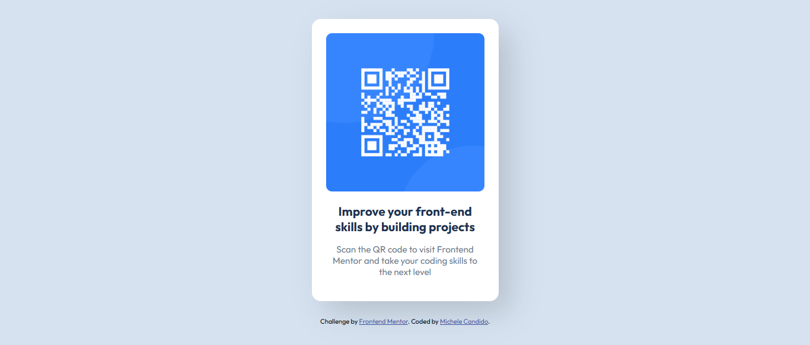

# 💌 Página QR Code

Olá! Este projeto é um desafio do site FrontEnd Mentor, criado para praticar minhas habilidades em HTML e CSS. A página é simples, contendo um QR Code que direciona diretamente ao site do FrontEnd Mentor, acompanhado de um texto de apresentação. O CSS é responsivo, garantindo boa visualização em mobile e tablets.

Link para o projeto: https://michelecandido.github.io/qr-code-responsive/

## ✨ Objetivos do projeto

O objetivo principal era praticar a construção de um **layout simples**, utilizando meu conhecimento adquirido em HTML e CSS. Além disso, usei esse desafio para aprender **CSS resposivo**, aplicando em diferentes tamanhos de tela.

## ✨ Tecnologias utilizadas

## ✨ Aprendizados

O maior desafio deste projeto foi aplicar CSS responsivo, e para isso, utilizei as seguintes soluções:
- Layout centralizado através de **Flexbox**.
- Uso de **media queries** com dois breakpoints (mobile e tablet).
- Ampliação do conhecimento em responsividade, adaptando o design para mobile, tablet e desktop.

## ✨ Links
- [Desafio no FrontEnd Mentor](https://www.frontendmentor.io/challenges/qr-code-component-iux_sIO_H)
- [Projeto no GitHub Pages](https://michelecandido.github.io/qr-code-responsive/)

---
 

Desenvolvido com 💖 por [Michele Candido](https://github.com/michelecandido).
